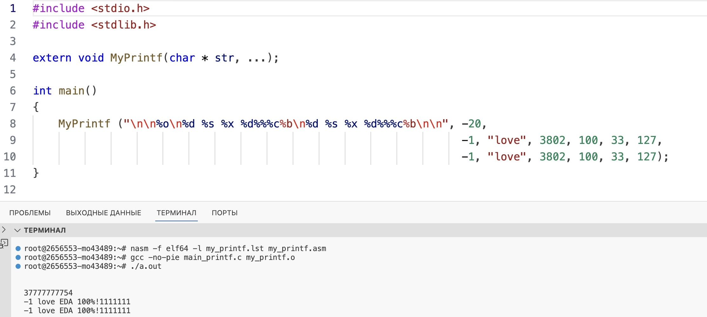

# Описание поставленной задачи.
Была поставлена задача написать на языке ассемблера свою функцию printf и запустить ее из кода, написанного на языке C.
## Поддерживаемые спецификаторы из стандартной функции printf.
%c - вывод переданного символа.

%s - вывод строки, адрес первого элемента которой передан функции.

%b - вывод целого числа в двоичной системе отсчета.

%o - вывод целого числа в восмеричной системе отсчета.

%d - вывод целого числа в десятичной системе отсчета.

%x - вывод целого числа в шестнадцатиричной системе отсчета.


\n - переход на новую строку.

# Описание макросов.
## .ExchangeSyms
### Описание.
Макрос перекладывает символ из фоматной строки в буфер вывода MainBuffer. Не принимает аргументов.

### Используемые регистры.
al - символ из форматной строки.

## .CheckBuffSize
### Описание.
Макрос проверяет размер оставшегося места в буфера вывода MainBuffer. Если места в буфере недостаточно, то буфер вывода зацикливается и начинает записывать символы с первой ячейки. Принимает два аргумента.
### Аргументы.
Первый аргумент: Размер необходимого места в буфере.

Второй аргумент: Название метки для пропуска закольцовывания.

## .2PowSpecs

### Описание.
Макрос переводит и записывает в строку число в системе отсчета со степенью двойки, переданной через аргумент. Принимает один аргумент.
### Аргументы.
Первый аргумент: степень системы отсчета.

### Используемые регистры:
rax - число, которое нужно записать в буфер ввывода.

r12 - сохраняет значение регистра rcx.

rcx - степень системы отсчета.

### Используемые функции:
TakeArg  - кладет в регистр rax аргумент функции MyPrintf.

Itoa2Pow - переводит число в строку.

## .WriteSymAndRenewNum

### Описание.
Кладет символ числа в буфер вывода MainBuffer. И сдвигает регистр с числом для определения следующего символа числа. Если искомое число после производимых над ним операций становится равным 0, то макрос передает управление записи его в буфер вывода. Принимает один аргумент.
### Аргументы:
Первый аргумент: метка для перехода к записи следующего симвода числа.
### Используемые регистры:
r11b - ASCII-код символа числа.

rax - число, которое нужно записать в буфер вывода.

cl - степень системы счисления.


## .Next
### Описание.
Переводит программу на считывание следующего символа форматной строки. Увеличивает значение регистра rdi и rbx для перехода к первому символу.

### Аргументы:
Первый аргумент: Первый аргумент макроса .CheckBuffSize.

### Используемые макросы:
.CheckBuffSize


# Описание функции MyPrintf.
## Действия, производимые компелятором при запуске функции из C.
В регистрах RDI, RSI, RDX, RCX, R8, R9 хранятся первые 6 аргументов, переданных функции. Остальные аргументы хранятся в < Stack >.

## Используемые регистры.
r15 - счетчик введенных аргументов. Исспользуется для того, чтобы в зависимости от номера аргумента получать их значение либо из регистров, либы из < Stack >.

rbx - хранит адрес элемента буфера вывода.

rdi - адрес элемента форматной строки.

## Используемые макросы.

.ExchangeSyms - перекладывает символ из форматной строки в буфер вывода.

.Next - подготавливает регистры к следующей иттерации.

## Описание функции по частям.

``` asm
            cmp byte [rdi], '%'
            je HandleSpec
```

Проверяет текущий символ форматной строки, если символ '%', то функция переходит по метке выюора определенного спецификатора.

``` asm
HandleSpec: call DoSpec
```

Вызывает функцию оперделения и исполнения конкретного спецификатора.

``` asm
            cmp byte [rdi], '\'
            ...
            inc rdi
            cmp byte [rdi], 'n'
            ...
            mov byte [rbx], 0ah
```

Если видит символ '\\', проверяет следубщий символ и записывает в буфер вывода символ перехода на следующую строку.


# Описание функции DoSpec.
## Описание.
Данная функция проверяет спецификатор и в зависимости от него выполняет конкретные дейсвия.

## Аргументы.
rdi - адрес элемента спецификатора форматной строки.

rbx - адрес элемента буфера вывода.

## Используемые регистры.
rax - адрес метки, которая выполняет определенные      спецификатором команды. Значение аргумента функции, вызываемой из C.

r12 - хранит значение регистра rsi.


## Используемые макросы.
.ExchangeSyms - перекладывает символ из форматной строки в буфер вывода.

.CheckBuffSize - проверяет оставшееся в буфере вывода место.

.2PowSpecs - выполняет запись чисел в системе отсчете с основанием двойки в степени.

## Используемые функции.
TakeArg - кладет в регистр rax значение аргументы функции.

Itoa10 - записывает десятичное число из регистра rax в виде строки.

## Описание функции по частям.
``` asm
            mov al, byte [rdi]

            mov rax, qword [8 * rax + JmpTable]
            jmp rax
```

Используя jump таблицу получаем адрес метки исполнения спецификатора.
### Краткое описание работы Jump таблицы.

``` asm
JmpTable:   times '%' -  0      dq  EndOfFunc
                                dq  PercSpec
            ...
```
#### Фрагмент с функцией times:
Чтобы описать все случаи со спецификаторами, я использовал times. Если функции передан неопределенный спецификатор, то с помошью Jump таблицы выполняется стандартный case c мгновенным ввыходом из функции исполнения спецификатора.

В таблицу поочередно записываются все возможные спецификаторы и в местах с определенным спецификатором содержится адрес метки его исполнения.

## Возвращаемые аргуенты.
rsi - увеличенное значение, с адресом следующего символа форматной строки.

rbx - увеличенное значение, с адресом последнего свободного места в буфере вывода.

# Описание функции Itoa10.
## Описание.
Функция принимает регистр rax cо значением десятичного числа и переводит его в строку.

## Аргументы.
rbx - адрес элемента буфера вывода.

## Используемые регистры.
r12 - хранит значение регистра rsi.

r13 - хранит значение регистра rdx.

rsi - адрес позиции первого символа числа.

r10b - основание системы отсчета.


## Испoльзуемые функции.
ReverseStr - из-за того, что изначально число записывается в строку в обратном порядке, необходимо перевернуть его.

## Возвращаемые аргументы.
rbx - увеличенное значение, с адресом последнего свободного места в буфере вывода.

# Описание функции Itoa2Pow.
## Опиание.
Функция принимает регистр rax cо значением числа, которое нужно записать в строку в системе остчета степени двойки.

## Аргументы.
rbx - адрес элемента буфера вывода.

## Используемые регистры.
r13 - хранит значение регистра rsi.

rsi - адрес позиции первого символа числа.

r10 - маска для получения кодов раздельных символов числа.

cl - количество символов в двоичной системе для определения конкретного символа числа.

r11 - код символа числа.

## Используемые макросы.
.CheckBuffSize - проверяет оставшееся в буфере вывода место.

.WriteSymAndRenewNum


## Используемые функции.
ReverseStr - переворачивает строку с числом.

## Описание функции по частям.

``` asm
                mov r10, 1
                shl r10, cl
                sub r10, 1
```
Создает маску для выделения определенного числа символов из числа.

## Возвращаемые аргументы.
rbx - увеличенное значение, с адресом последнего свободного места в буфере вывода.

# Описание функции ReverseStr.
## Описание.
Функция переворачивает число относительно центра.
## Аргументы.
rbx - адрес элемента буфера вывода.

## Используемые регистры.
r11 - сохраняет значение регистра rbx.

r14 - сохраняет значение регистра rdx.

dl/dh - противоположные относительно центра символы, которые нужно обменять местами.

# Описание функции TakeArg.
## Описание.
В зависимости от номера аргумента функции определяет из откуда брать его значение.
## Аргументы.
r15 - номер аргумента функции.

## Используемые регистры.
rax - адрес метки, в которой rax присваивается значение аргумента из определенного места памяти. Значение аргумента функции.

rsi - первый после форматной строки аргумент функции.

rdx - второй после форматной строки аргумент функции.

rcx - третий после форматной строки аргумент функции.

r8 - четвертый после форматной строки аргумент функции.

r9 - пятый после форматной строки аргумент функции.

rsp - указатель на верхушку стэка.

## Описание функции по частям.
``` asm
                mov rax, [rsp + StackProloge + rax * 8]
```
С помощью стэкового фрейма берем значения аргументов функции.

StackProloge - часть стэка, в которой лежат адреса возврата функций, вызванных ранее.

### Краткое описание работы Jump таблицы регистров.
``` asm
                mov rax, qword [8 * r15 + RegTable]
                jmp rax
```
В зависимости от номера аргумента в регистр rax кладется адрес метки, которая определяет регистр, в котором лежит данный аргумент.

## Возвращаемые аргументы.
r15 - увеличенный счетчик числа аргументов функции.

# Описание функции PrintStr.
## Описание.
Функция печатает буфер вывода на экран.
## Аргументы.
rbx - адрес последнего символа в буфере вывода.

## Используемые регистры.
r10 - сохраняет значение rdx.

r12 - сохраняет значение rdi.

r13 - сохраняет значение rsi.

rsi - адрес первого символа буфера вывода.

rdx - число символов, выводимых на печать.

rax - номер функции системного вызова.

rdi - размер одного символа.

# Пример работы программы на C.


## Сборка программы в системе под управлением операционной системы Linux.

```
nasm -f elf64 -l my_printf.lst my_printf.asm
```
Создаем объектный файл для ассемблерной программы.

```
gcc -no-pie main_printf.c my_printf.o
```

Компилируем код, написанный на языке C вместе с ассемблерной программой.

```
./a.out
```
Запускаем программу.
